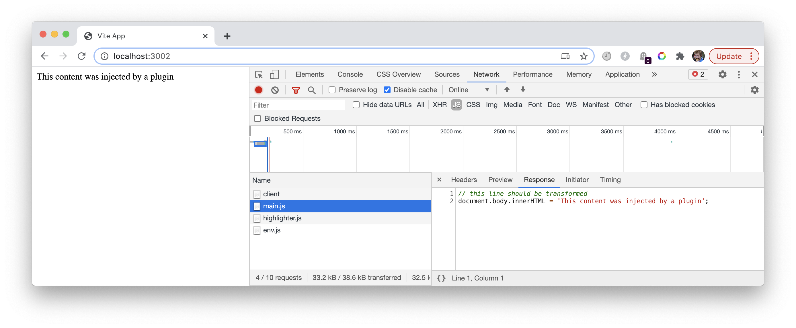
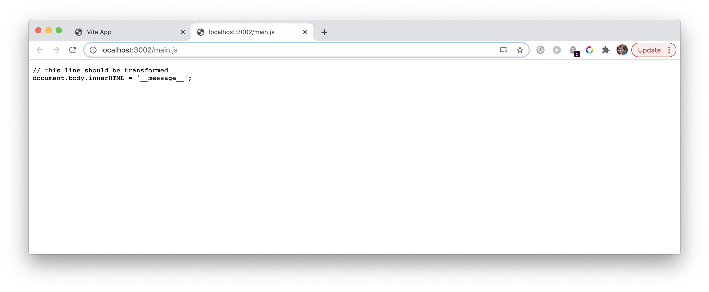

# vite-repro-transformation

This is a small repro to help me understand an aspect of Vite's behaviour, namely that transformations are applied if a file is imported, but _not_ if the file is requested by some other means.

To see what I mean, run `vite` in this repo and open devtools. Reload so that the network tab populates, and notice that `main.js` has been transformed as per the plugin in [vite.config.js](vite.config.js):

If you access `/main.js` directly, you get the untransformed file:

Two questions:

1. ~~How is Vite doing this?! How does it differentiate between imports (that require a transformation) and regular requests?~~
    * Ok, I see what's going on — `transformMiddleware` checks whether `req.headers.accept?.includes('text/html')`
2. What's the rationale for this behaviour? It feels like things would be more predictable and debuggable if the response was the same in both cases (I'm currently experiencing difficulties getting CSS to work correctly with SSR'd responses because of this issue)